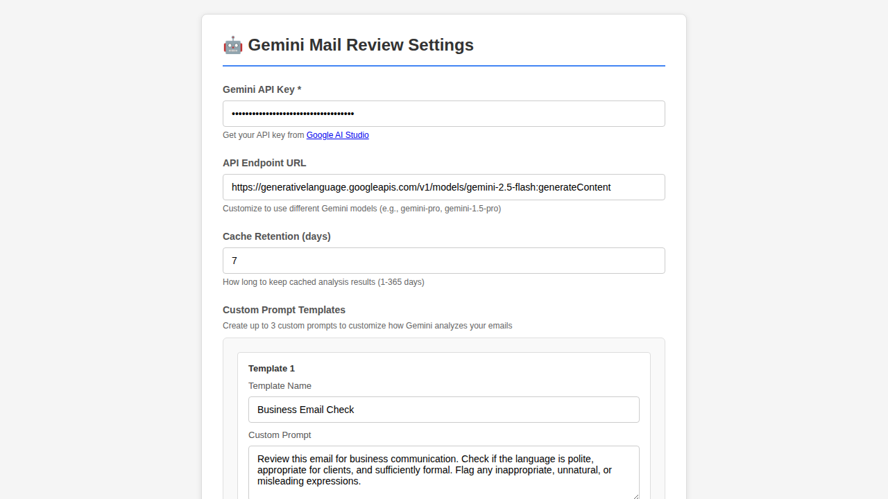
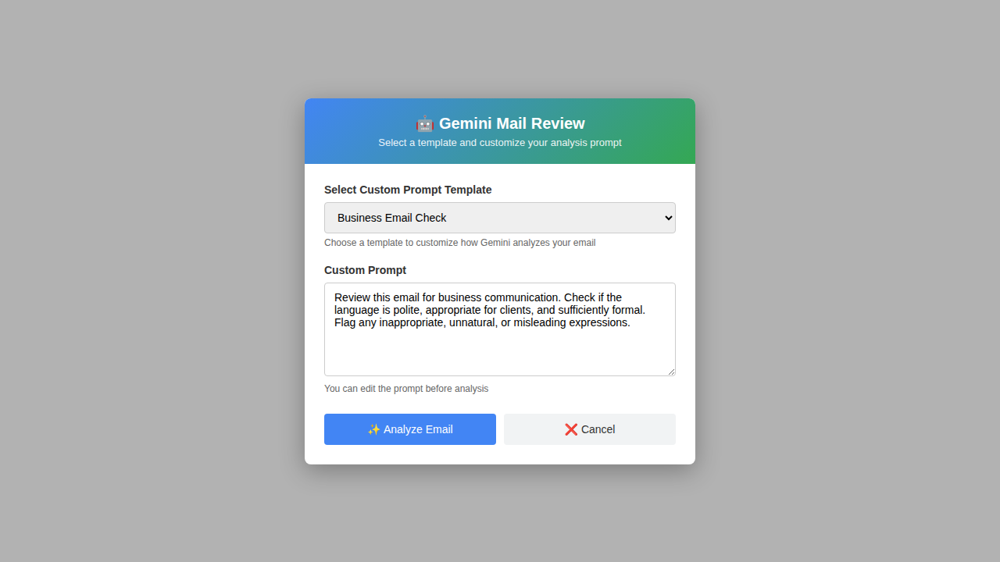
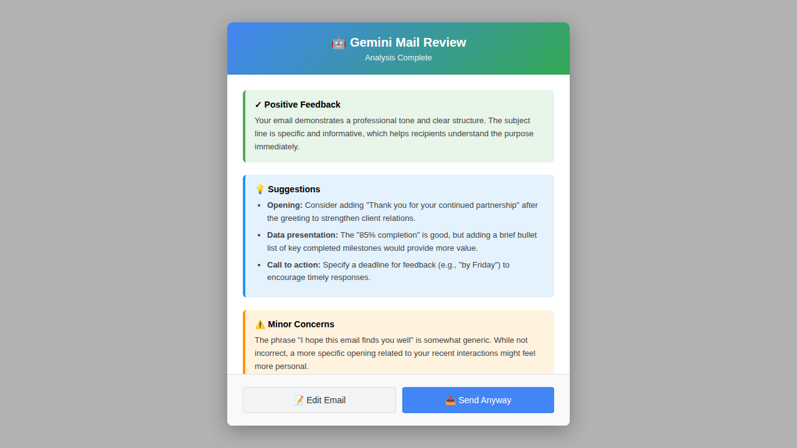
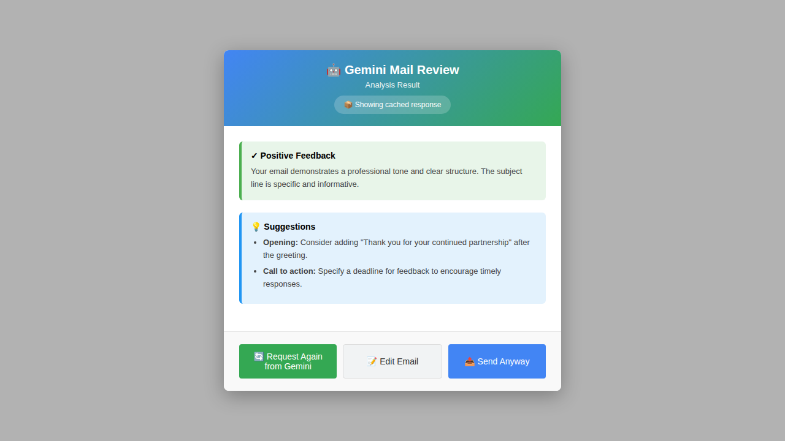
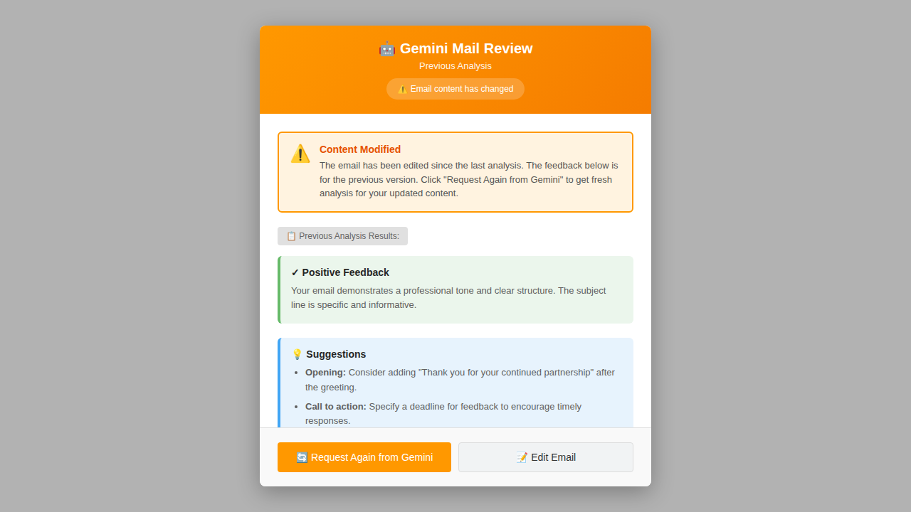

# 使い方ガイド

[English](USAGE.md) | 日本語

## クイックスタート

1. **アドオンのインストール**
   - Thunderbird にアドオンをインストール（インストール手順は README.ja.md を参照）

2. **API キーとエンドポイントの設定**
   - **ツール** → **アドオンとテーマ** を開く
   - **Gemini Mail Review** を見つけて **設定** をクリック
   - Gemini API キーを入力
   - （オプション）別の Gemini モデルを使用するために API エンドポイント URL をカスタマイズ
     - デフォルト: `https://generativelanguage.googleapis.com/v1/models/gemini-2.5-flash:generateContent`
     - `gemini-pro`、`gemini-1.5-pro` などの他のモデルを使用するように変更可能
   - （オプション）Gemini がメールを分析する方法をカスタマイズするためにカスタムプロンプトテンプレートを追加
     - 最大3つのカスタムプロンプトテンプレートを名前付きで保存できます
     - 各テンプレートには説明的な名前とカスタム指示を設定できます
     - **多言語対応**: カスタムプロンプトは任意の言語で記述でき、Gemini は同じ言語で応答します
       - 英語のプロンプト → 英語の分析結果
       - 日本語のプロンプト → 日本語の分析結果
       - スペイン語のプロンプト（Español） → スペイン語の分析結果（Español）
       - Gemini がサポートするすべての言語で利用可能
     - ビジネスメールチェックの例（日本語）: "以下のメール本文が、取引先・顧客など会社宛てのメールとして、敬語や言い回しが適切か、失礼・不自然・誤解を招く表現がないか、ビジネスメールとして十分にフォーマルかを確認してください。問題点があれば、理由とあわせて修正案を提示してください。"
     - ビジネスメールチェックの例（英語）: "Review this email for business communication. Check if the language is polite, appropriate for clients, and sufficiently formal. Flag any inappropriate, unnatural, or misleading expressions."
   - **接続テスト** をクリックして設定を確認
   - **設定を保存** をクリック

   
   *API キー設定、カスタムプロンプト、その他のオプションを示す設定画面*

3. **メールを作成**
   - 新規メールを作成するか、既存のメールに返信
   - 通常通りメールを書く

4. **送信前にレビュー**
   - 送信ボタンをクリックする前に、作成ツールバーの **Gemini Mail Review** アイコンをクリック
   
   
   *Thunderbird 作成ウィンドウツールバーの Gemini Mail Review アイコン*
   
   - ポップアップがテンプレート選択画面で開きます：
     - ドロップダウンからカスタムプロンプトテンプレートを選択（設定済みの場合）
     - 必要に応じてカスタムプロンプトを確認・編集
     - **メールを分析** をクリックして分析を開始
   
   
   *テンプレート選択とカスタムプロンプトエディタを示すポップアップ*
   
   - AI 分析を待つ（通常 2〜5 秒）
   
   
   *分析処理中*
   
   - フィードバックを確認
   
   
   *AI フィードバックと提案が表示される*

5. **フィードバックへの対応**
   - **メールを編集**: ポップアップを閉じて、提案に基づいて変更を加える
   - **このまま送信**: ポップアップを閉じて送信を続行（まだ送信ボタンをクリックする必要があります）

## キャッシュ結果の理解

同じメールを複数回分析すると、アドオンはスマートキャッシングを使用して API コールを節約し、即座にフィードバックを提供します。

### キャッシュされたレスポンス
すでに分析したメールを再度レビューすると、キャッシュされたレスポンスのインジケータが表示されます：


*「📦 キャッシュから表示中」インジケータとともに即座に表示されるキャッシュされた分析結果*

### 内容変更の警告
メールを分析した後に編集すると、次回のレビューでは警告とともに前回の分析が表示されます：


*「⚠️ メール内容が変更されています」警告と、新しい分析をリクエストするオプションとともに表示される前回の分析*

これにより、次のことができます：
- 以前のフィードバックをすぐに確認する
- 変更内容に対して新しい分析が必要かどうかを判断する
- 更新された内容の新しい分析が必要な場合は「Geminiに再リクエスト」をクリックする

## 使用例

### 文法エラーのチェック
**シナリオ**: メールにタイプミスや文法ミスがないか確認したい。

**アクション**: Gemini Mail Review ボタンをクリック。AI がスペルと文法エラーを特定し、修正を提案します。

### プロフェッショナルなトーンの確認
**シナリオ**: 重要なビジネスメールを送信する際、プロフェッショナルな印象を与えたい。

**アクション**: レビュー機能を使用してトーンとプロフェッショナリズムについてフィードバックを取得。AI がトーンが適切かどうか、調整が必要かを教えてくれます。

### 添付ファイルの欠落を検出
**シナリオ**: メールに「添付ファイルをご参照ください」と書いたが、ファイルを添付し忘れた。

**アクション**: AI は添付ファイルへの言及を検出し、添付されていない場合に警告します（注: メール本文に添付ファイルの記載が必要です）。

### 明瞭さのチェック
**シナリオ**: 複雑なメールを書いたので、内容が明確かどうか確認したい。

**アクション**: レビューは不明瞭な箇所を特定し、明瞭さと簡潔さを向上させる方法を提案します。

### 多言語メールレビュー
**シナリオ**: 英語以外の言語でメールを書いており、母国語で分析を受けたい。

**アクション**: 希望する言語でカスタムプロンプトテンプレートを作成します。AI は同じ言語でメールを分析し、フィードバックを提供します。例えば：
- 日本語でカスタムプロンプトを記述 → 日本語で分析結果を取得
- スペイン語でカスタムプロンプトを記述 → スペイン語で分析結果を取得
- フランス語でカスタムプロンプトを記述 → フランス語で分析結果を取得

**言語別カスタムプロンプトの例**:

**日本語**:
```
このメールを分析して、以下の点を確認してください：
- 文法とスペルミス
- 敬語の適切な使用
- ビジネスメールとしての適切さ
- 言い回しの自然さ
問題点があれば、理由と修正案を日本語で提示してください。
```

**英語 (English)**:
```
Review this email for business communication. Check:
- Grammar and spelling
- Professional tone
- Message clarity
- Potential issues
Provide feedback and suggestions in English.
```

**スペイン語 (Español)**:
```
Analiza este correo electrónico y verifica:
- Gramática y ortografía
- Tono profesional
- Claridad del mensaje
- Posibles problemas
Proporciona comentarios y sugerencias en español.
```

**フランス語 (Français)**:
```
Analysez cet e-mail et vérifiez:
- La grammaire et l'orthographe
- Le ton professionnel
- La clarté du message
- Les problèmes potentiels
Fournissez des commentaires et des suggestions en français.
```

## レビュー結果の理解

AI 分析には通常、以下が含まれます：

- **✓ ポジティブなフィードバック**: メールでうまく機能している点
- **⚠️ 警告**: 懸念される可能性があるが、必ずしもエラーではないもの
- **❌ 問題**: 送信前に対処すべき問題
- **💡 提案**: 改善のための具体的な推奨事項

## 最良の結果を得るためのヒント

1. **最初に書いて、後でレビュー**: より包括的なフィードバックを得るために、レビューを実行する前にメールを完成させる
2. **説明的な件名を使用**: より良いコンテキスト分析のために件名を含める
3. **定期的にレビュー**: 重要なメールを送信する前にレビューすることを習慣にする
4. **過度に依存しない**: AI を自分の判断の代わりではなく、有用なアシスタントとして使用する
5. **プライバシーへの配慮**: メールが Google の API に送信されて分析されることを忘れない

## トラブルシューティング

### 分析結果が表示されない
- インターネット接続を確認
- API キーが正しく設定されているか確認
- API レート制限を超えていないか確認

### レスポンスが遅い
- 大きなメールは分析に時間がかかる
- API のレスポンス時間はサーバーの負荷によって変動する
- 非常に長いメールの場合は、セクションごとにレビューすることを検討

### 不正確な提案
- AI は有用だが完璧ではない
- 提案を評価する際は自分の判断を使用する
- コンテキストが重要 - 受信者のことは AI よりもあなたの方がよく知っている

### API キーの問題
- API キーが有効でアクティブであることを確認
- クォータを超えていないか確認
- 古いキーが機能しない場合は、新しいキーを生成

## プライバシーとセキュリティ

- **送信されるもの**: 件名、受信者、メール本文
- **送信されないもの**: 添付ファイル、あなたの API キー（Google を除く）
- **データ保存**: API キーは Thunderbird にローカル保存される
- **データ送信**: HTTPS を介して Google の Gemini API に安全に送信される
- **保持**: Google が API データをどのように処理するかについては、Google のプライバシーポリシーを参照

## API の使用と制限

Google の Gemini API の無料枠には以下が含まれます：
- 1 分あたり 60 リクエスト
- 通常のメール使用には十分

制限を超えた場合：
- エラーメッセージが表示される
- 1 分待ってから再試行
- 必要に応じて API プランのアップグレードを検討

## ベストプラクティス

1. **事前チェック**: 重要なメールを送信する前に必ずレビュー
2. **複数回のレビュー**: レビュー後に大幅な変更を加えた場合は、再度レビュー
3. **フィードバックから学ぶ**: AI があなたの文章で特定する一般的な問題に注意を払う
4. **校正と組み合わせる**: 自分自身の校正と並行して AI レビューを使用
5. **コンテキストの認識**: より良い分析のために、必要に応じてメールにコンテキストを追加

## 機能リクエストとフィードバック

提案や問題が見つかった場合は、プロジェクトの GitHub リポジトリでご報告ください。
